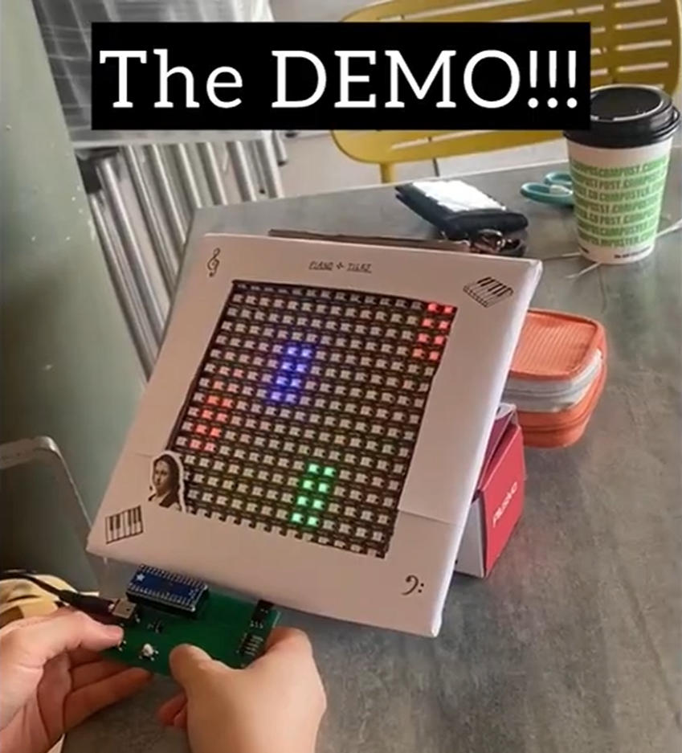

# Piano Tiles 
A WS2812B LED array game written with "bare metal" C for the MSPM0G3507 for your simple entertainment needs...

## Demo Video

# Full-Length Project Presentation
[Link to Video](https://www.youtube.com/watch?v=NS4r-wqRMFE)

# Team Members
- Cindy Nguyen
- Maha Razzaq
- Joanna Li
- Ivana Zak
  
# Project Report
[Link to Report](/report.pdf)
